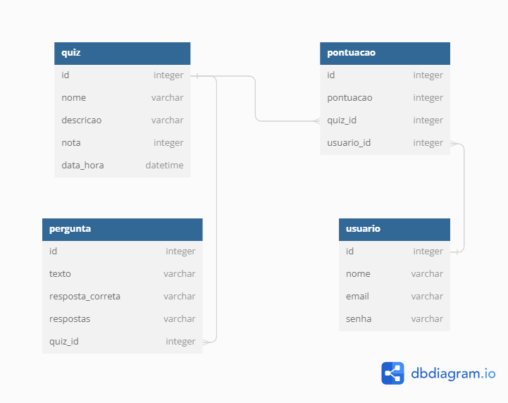
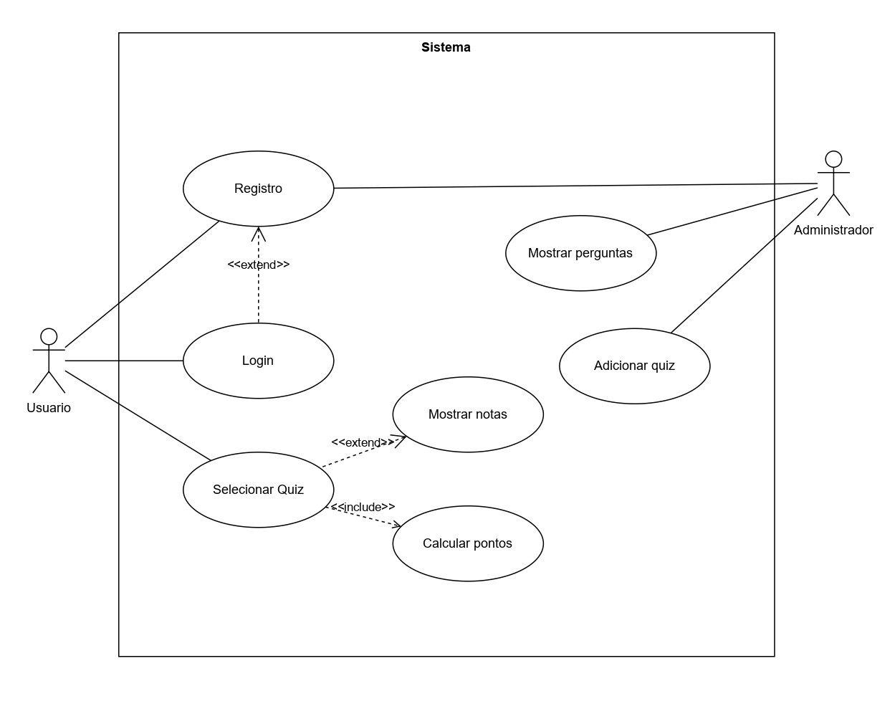

# Visão Geral

O Geoquizzler é uma plataforma online dedicada a desafiar seus conhecimentos geográficos por meio de um sistema de perguntas diversas. Nosso objetivo é proporcionar uma experiência interativa e educativa, permitindo que os usuários testem e aprimorem seus conhecimentos de geografia de maneira divertida.

## Funcionalidades Principais 

- **Cadastro login e senha:** Os usuários podem criar uma conta gratuita no site, informando seu nome, e-mail e senha. Isso permite que eles acessem o quiz, vejam seu histórico de pontuação.

- **Pontuação e nota:** Os usuários ganham pontos a cada pergunta respondida corretamente. Ao final do quiz, os pontos são convertidos em uma nota de S a F, sendo S a pontuação perfeita e F a pontuação muito ruim. A nota é exibida na tela junto com uma mensagem de feedback.

### Exploração e Experiência de Usuário
- **Pagina Inicial:** Na página inicial, apresentamos uma interface intuitiva com três abas distintas, cada uma oferecendo uma experiência única. Explore uma variedade de quizzes na aba "Quizzes", gerencie seu perfil na aba "Perfil" e conheça mais sobre os criadores e contribuições no "Sobre Nós". Desfrute da navegação simplificada enquanto aprimora seus conhecimentos geográficos de maneira envolvente.

- **Historico de pontuação:** O histórico de pontuações é uma função que permite aos usuários ver seu progresso e desempenho em cada quiz que eles realizaram. Você pode acessar o histórico de pontuações clicando no ícone de perfil na página inicial e selecionando a opção “Histórico”. Lá, você pode ver a lista de quizzes que você completou, a data e hora que você os fez e a pontuação que você obteve em cada um. O histórico de pontuações é uma ótima maneira de revisar seus erros e acertos, aprender com eles e melhorar seus conhecimentos.

- **Escolha de quizzes:** Na aba quizzes, os usuários têm acesso a uma variedade de quizzes. Eles podem explorar os quizes em destaque ou realizar buscas por títulos específicos, proporcionando uma experiência de aprendizado personalizada.

- **Sobre nós:** Explore informações sobre os criadores do sistema, destacando suas contribuições para a plataforma podendo tambem acessar os Links para o GitHub de cada um dos criadores. Conheça as mentes por trás da inovação geográfica.

## Diagramas

### Modelo relacional do Banco de dados

### Diagrama de caso de uso

